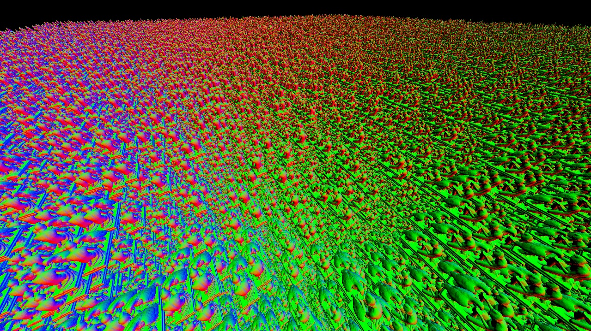

# Rust & Vulkan test projects
Contains test projects for Rust & Vulkan

The first test project renders 1 million cubes, each containing a 950 MB (uncompressed) distance field volume. It uses an optimized cube renderer rendering only front faces of each cube. 

The second test project is going to be using sparse octree storing a hierarchy of distance field volume bricks, each rasterized as a cube. This will both reduce the SDF volume memory consumption by 98% and make the runtime faster, as most rays missing the object will not be cast at at all, and the remaining rays will start very close to the surface.

The second test project will use a GPU-driven culling solution slightly similar to the one we presented at SIGGRAPH 2015:
https://advances.realtimerendering.com/s2015/aaltonenhaar_siggraph2015_combined_final_footer_220dpi.pdf

Various optimization techniques will be tested on top of this prototype.

# Todo
* Conservative depth output
* GPU-driven occlusion culling
* Command line tool for SDF processing (sdf.rs functionality)
* Sparse SDF test project
* More than one SDF volume (easy to implement for sparse SDF)

# Install instructions
* Install rustup: https://www.rust-lang.org/tools/install
* Install Vulkan SDK: https://vulkan.lunarg.com/sdk/home
* Install git LFS: https://git-lfs.github.com/
* Run (cmd): **git lfs install**
* Clone repository (cmd): **git clone https://github.com/sebbbi/rust_test.git**
* **IMPORTANT:** Zip download does NOT support git LFS!
* Run (cmd): **cargo run --release**
* If you want to recompile shaders, Run (cmd): **compile_shaders.bat**

# How to use the prototype
* Start (cmd): **cargo run --release**
* WASD = fly around
* Drag mouse left button = rotate camera
* Mouse wheel = jump backward / forward

# How to import a new SDF (from .obj file)
* Clone my SDFGen fork: https://github.com/sebbbi/SDFGen
* This version of SDFGen has 16 bit binary output. Which is compatible with rust_test
* Compile the project with a C++ compiler of your choice (use x64 target)
* Run (cmd): **SDFGen.exe your_file.obj 0.125 32** (the 0.125 is the voxel size, use larger value if the SDF resolution is too large)
* Replace this line with load_sdf("your_file.sdf"): https://github.com/sebbbi/rust_test/blob/main/src/main.rs#L45

## License
This repository contents are released under the MIT license. See [LICENSE.md](LICENSE.md) for full text.
